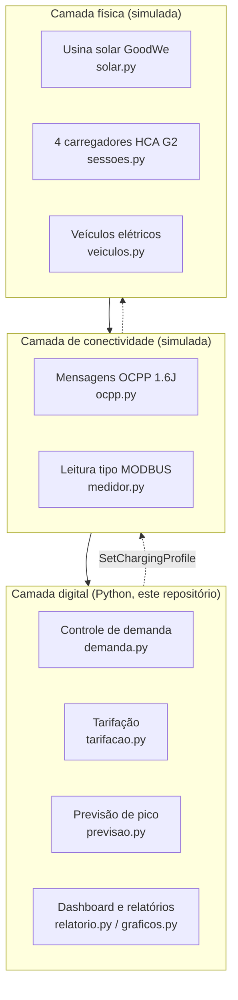
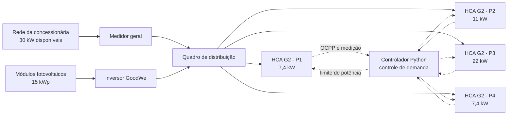
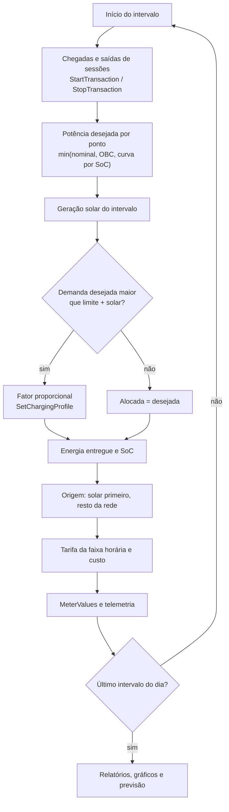
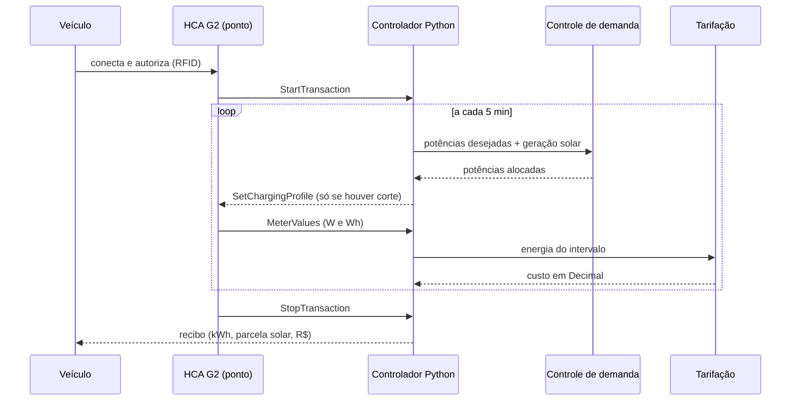
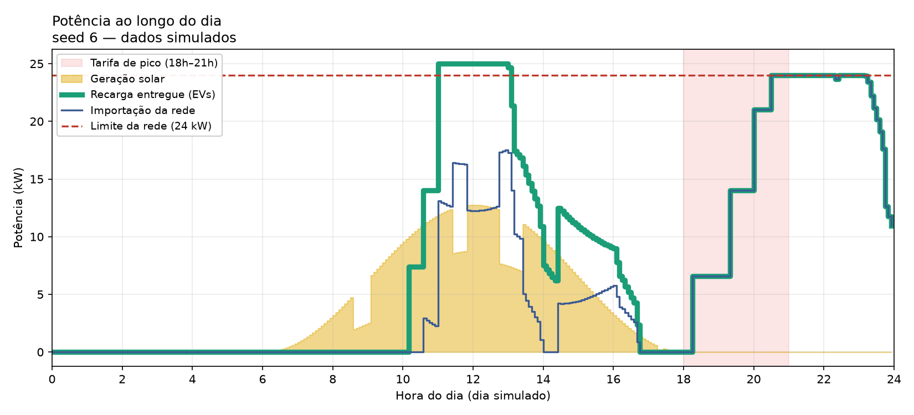
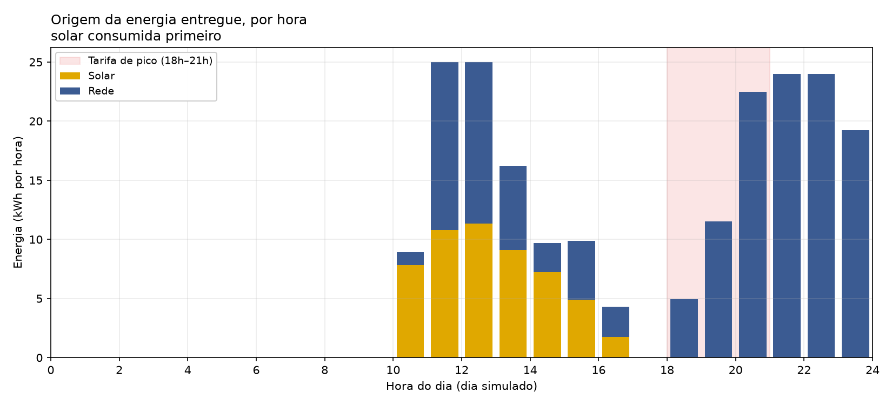
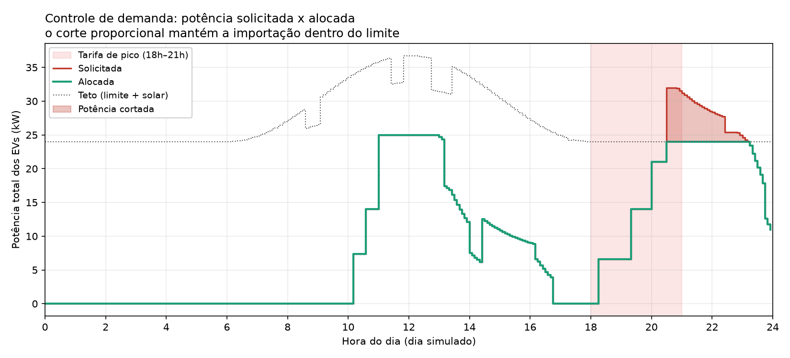
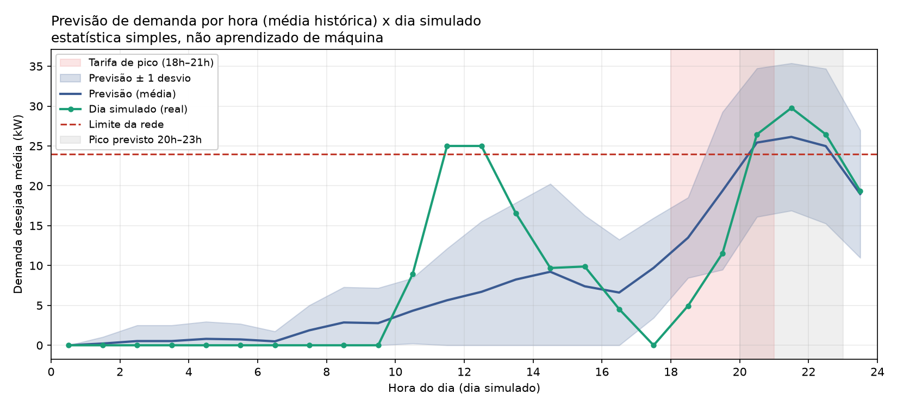

# ChargeGrid Intelligence — Sprint 3

[](https://github.com/thorflk/SPRINT03-PYTHON-GTLF/actions/workflows/ci.yml)

### Pensamento Computacional e Automação com Python · FIAP x GoodWe · EV Challenge 2026 · Grupo GTLF

> **Aviso:** todos os dados deste repositório são **simulados**. Não há hardware, rede OCPP/MODBUS nem
> medição real. A simulação segue premissas técnicas documentadas e rastreáveis (seção 10).

O ChargeGrid Intelligence transforma um eletroposto comercial em uma plataforma de gestão de energia. Nesta
Sprint 3, a prova de conceito da Sprint 2 virou um **protótipo integrado**: usina solar GoodWe, medidores,
mensagens OCPP, controle de demanda, tarifação por faixa horária e previsão de pico funcionam juntos em uma
simulação de um dia inteiro, com dashboard, gráficos, arquivos de dados e testes automatizados.

## 1. Equipe

| Nome | RM |
|---|---|
| Fernando Hideki Rosa Oda | 571408 |
| Léo Moreno Sambo | 569556 |
| Thor Ferreira Camargo | 569543 |
| Gabriel Botelho Romão | 570589 |
| Rafael Marinucci Peres | 569729 |
| David dos Reis Cardoso | 568938 |

## 2. Vídeo técnico

Vídeo (YouTube, não listado, até 5 minutos): [https://youtu.be/3GN9RzPSDQU](https://youtu.be/3GN9RzPSDQU)

## 3. Evolução: Sprint 1 → Sprint 2 → Sprint 3

| | Sprint 1 | Sprint 2 | Sprint 3 (este repositório) |
|---|---|---|---|
| Entrega | Pesquisa: problema, 4 pilares, arquitetura em 3 camadas | `main.py` com 4 módulos executados em sequência | Componentes que **se comunicam** em um laço de simulação de 5 em 5 minutos |
| Energia renovável | Não abordada | Só citada no README, sem código | Usina solar simulada, consumida **primeiro**, com nuvens |
| Controle de demanda | Descrito | Fator proporcional sobre o total pedido | Fator proporcional com teto `limite + solar`, comandos `SetChargingProfile` e invariante testado |
| Protocolos abertos | OCPP e MODBUS citados | Não representados | Mensagens OCPP 1.6J e registradores estilo MODBUS (simulados) gravados em log |
| Tarifação | Descrita | Uma tarifa por sessão | Tarifa por **intervalo** (uma sessão que cruza as 18h paga cada parte na faixa certa), em `Decimal` |
| IA | Conceito | Texto fixo de recomendação | Previsão estatística por hora, com **backtest** contra um baseline |
| Evidências | Documento e slides | Saída de terminal | CSV, JSON, log OCPP, 4 gráficos, dashboard e suíte de testes |

**Correção importante em relação à Sprint 2.** Lá, as sessões eram geradas sempre entre 17h e 17h30, e a tarifa
de pico só vale a partir das 18h. Na prática, a tarifa de pico **nunca era aplicada** e a recomendação de "evitar o
pico" não era demonstrada em nenhuma execução. Nesta Sprint o perfil de chegadas segue um dia de shopping (pico à
noite) e o efeito da tarifa aparece nos resultados.

## 4. Esquema de integração dos componentes

Os quatro diagramas abaixo também estão em [`docs/diagramas.md`](docs/diagramas.md).

### 4.1 Blocos: as três camadas da Sprint 1 no protótipo



### 4.2 Esquema elétrico unifilar simplificado



A rede entrega no máximo **24 kW** aos carregadores (30 kW disponíveis × 0,80 de margem de segurança). A geração
solar entra no mesmo barramento e reduz a importação da rede: por isso o teto de potência para os veículos é
`limite + solar`.

### 4.3 Fluxograma do laço de simulação (um intervalo de 5 min)



### 4.4 Sequência de uma sessão de recarga



## 5. Justificativa técnica das escolhas

| Componente | Arquivo | Por que assim | Sustentabilidade | Automação inteligente | Eficiência energética |
|---|---|---|---|---|---|
| Carregadores GoodWe HCA G2 (7,4 / 11 / 22 kW) | `config.py`, `sessoes.py` | É o equipamento adotado no Challenge, então o protótipo simula o mesmo hardware; três potências nominais cobrem carregamento monofásico e trifásico e evidenciam o gargalo do veículo (OBC), que limita a potência real | Eletromobilidade no lugar do combustível fóssil | Cada ponto é comandado individualmente pelo controlador | Potência ajustável por ponto permite dividir a carga disponível |
| Usina solar GoodWe | `solar.py` | O inversor GoodWe é o ponto de contato do desafio com energia renovável; a curva em sen² com nuvens é simples e suficiente para mostrar a sinergia com as recargas | Energia limpa consumida no local | — | A solar entra **antes** da rede e amplia o teto de potência |
| Medidor estilo MODBUS | `medidor.py` | O MODBUS é o padrão de medidores citado na Sprint 1; dois registradores (W e Wh) bastam para telemetria | — | Fonte dos dados que alimentam as decisões | Medição por ponto permite auditar cada kWh |
| Mensagens OCPP 1.6J | `ocpp.py` | O OCPP é o protocolo aberto que padroniza carregadores de marcas diferentes (problema da Sprint 1); o log em JSON Lines é a evidência dos comandos automatizados | — | O controlador comanda os pontos sem intervenção humana (`SetChargingProfile`) | Só há comando quando há corte, sem tráfego desnecessário |
| Controle de demanda | `demanda.py` | O corte **proporcional** preserva a equidade entre usuários e já foi validado na Sprint 2; a solar amplia o teto em vez de ser tratada à parte | Menos importação de rede no pico | Decisão automática a cada 5 min | Evita multa por demanda e sobrecarga (a rede nunca passa de 24 kW em nenhum intervalo simulado) |
| Tarifação por faixa | `tarifacao.py` | Cobrar por intervalo evita erro em sessões que cruzam as 18h; `Decimal` evita erro de arredondamento em dinheiro | Sinal de preço desloca consumo | Custo calculado sem intervenção | Incentivo a recarregar fora do pico |
| Previsão de pico | `previsao.py` | Média histórica por hora captura a sazonalidade diária com pouco código e é fácil de explicar; o backtest mostra que ganha de um baseline constante | — | Recomenda horários e aponta o pico | Planejamento antes da sobrecarga |
| Python + pandas + matplotlib | `relatorio.py`, `graficos.py` | Automatizam a coleta, a agregação e a exibição dos dados | — | Pipeline completo em um comando | Métricas objetivas (kWh, % solar, R$) |

## 6. Resultados e dados funcionais

Dia simulado com a seed de demonstração (`python main.py`). A seed foi escolhida por uma regra explícita
(seção 10) e, para mostrar que o comportamento **não depende dela**, a seção 6.5 traz uma varredura de 30 seeds.

### 6.1 Indicadores do dia

| Indicador | Valor |
|---|---|
| Sessões (concluídas / recusadas) | 8 (6 / 1) |
| Energia entregue | 205,2 kWh |
| Geração solar consumida | 52,9 kWh (25,8%) |
| Energia da rede | 152,3 kWh |
| Pico de demanda desejada | 32,0 kW |
| Pico de importação da rede (limite 24 kW) | 24,0 kW |
| Tempo com corte de demanda | 160 min |
| Receita total | R$ 195,88 |
| Receita no pico / fora do pico | R$ 54,58 / R$ 141,30 |
| Economia do operador com solar (premissa: rede a R$ 0,60/kWh) | R$ 31,75 |
| CO₂ evitado vs combustão | 153,9 kg |
| Janela de pico prevista | 20h–23h |
| Erro da previsão (modelo / baseline constante) | 4,12 kW / 8,98 kW |

Arquivos brutos em [`docs/resultados/`](docs/resultados/): `resumo.json`, `sessoes.csv`, `dashboard.txt`,
`ocpp_exemplo.jsonl` e os quatro gráficos.

### 6.2 Gráficos

**Potência ao longo do dia.** De dia, a solar (área amarela) cobre parte da recarga: a linha verde (EVs) fica
acima da azul (rede). Às 20h30, a demanda encosta no limite de 24 kW e a rede fica limitada. À noite as duas
linhas coincidem, porque não há sol.



**Origem da energia por hora.** Nas 4 sessões diurnas, **53,4%** da energia veio da usina solar; nas 4 sessões
noturnas, **0%**. Antes das 18h foram entregues 99,0 kWh; depois, 106,2 kWh, todos vindos da rede.



**Controle de demanda.** Entre 20h30 e 23h10 (160 min), os carregadores pediram até 32,0 kW e o sistema alocou 24,0 kW
(fator de corte entre 75% e 99%). A área vermelha é a potência que foi cortada, distribuída proporcionalmente.



**Previsão de pico.** A média histórica de 14 dias prevê o pico entre 20h e 23h (25,5 kW médios, 106% do limite). O dia
simulado, que o modelo não viu, confirma o padrão.



### 6.3 O que os números mostram

- **A solar ajuda, mas não resolve o pico.** Ela cobre 25,8% da energia do dia, porém o pico de demanda da rede é
  noturno. Isso motiva a recomendação da previsão (recarregar de 9h a 11h) e uma evolução natural com **bateria**
  (seção 10).
- **A faixa de tarifa de pico não coincide com o pico de demanda.** A tarifa de pico vale das 18h às 21h, mas a
  demanda prevista se concentra entre 20h e 23h. O programa aponta isso na recomendação ("cobre só parte dessa
  janela"), o que sugere estender a faixa. É um achado da simulação, e não uma conclusão sobre um caso real.
- **O controle de demanda funcionou como projetado:** em todos os intervalos, `rede ≤ 24 kW`.

Trecho real do dashboard (`docs/resultados/dashboard.txt`):

```text
──── Operação ────────────────────────────────────────────────────
  Sessões: 8 (6 concluídas, 1 recusada por falta de ponto)
  Pico de demanda desejada  : 32,0 kW
  Limite da rede            : 24,0 kW (30 kW disponíveis x 0,80)
  Pico de importação        : 24,0 kW
  Tempo com corte de demanda: 160 min
```

### 6.4 Comandos automatizados: log OCPP

O dia simulado gerou **455 mensagens** OCPP: 360 `MeterValues`, 79 `SetChargingProfile`, 8 `StartTransaction` e
8 `StopTransaction`. Quatro exemplos (uma de cada ação, de `docs/resultados/ocpp_exemplo.jsonl`):

```json
{"instante": "2026-09-22T10:10:00Z", "ponto": "P1", "direcao": "CP->CS", "mensagem": [2, "msg-00001", "StartTransaction", {"connectorId": 1, "idTag": "RFID-001", "meterStart": 0, "timestamp": "2026-09-22T10:10:00Z"}]}
{"instante": "2026-09-22T10:15:00Z", "ponto": "P1", "direcao": "CP->CS", "mensagem": [2, "msg-00002", "MeterValues", {"connectorId": 1, "transactionId": 1, "meterValue": [{"timestamp": "2026-09-22T10:15:00Z", "sampledValue": [{"value": "7400", "measurand": "Power.Active.Import", "unit": "W"}, {"value": "617", "measurand": "Energy.Active.Import.Register", "unit": "Wh"}]}]}]}
{"instante": "2026-09-22T13:10:00Z", "ponto": "P2", "direcao": "CP->CS", "mensagem": [2, "msg-00097", "StopTransaction", {"transactionId": 2, "meterStop": 16800, "timestamp": "2026-09-22T13:10:00Z", "reason": "EVDisconnected"}]}
{"instante": "2026-09-22T20:30:00Z", "ponto": "P3", "direcao": "CS->CP", "mensagem": [2, "msg-00227", "SetChargingProfile", {"connectorId": 1, "csChargingProfiles": {"chargingProfileId": 227, "stackLevel": 0, "chargingProfilePurpose": "TxProfile", "chargingProfileKind": "Absolute", "chargingSchedule": {"chargingRateUnit": "W", "chargingSchedulePeriod": [{"startPeriod": 0, "limit": 4950}]}}}]}
```

### 6.5 Varredura de 30 seeds

Para verificar que o resultado não é fruto de uma seed favorável, `python -m chargegrid.varredura` simula 30 dias
diferentes ([tabela completa](docs/resultados/varredura_seeds.md)):

- 27 das 30 seeds tiveram corte de demanda; média de **180,8 kWh/dia** entregues e **17,2%** de energia solar;
- maior importação da rede: **24,00 kW** (o limite); **0 violações** do limite em todos os intervalos.

## 7. Conexão com os conteúdos da disciplina

### 7.1 Os quatro pilares do pensamento computacional

| Pilar | Onde aparece no projeto |
|---|---|
| **Decomposição** | O problema foi dividido em módulos com uma responsabilidade cada (`solar`, `sessoes`, `demanda`, `tarifacao`, `ocpp`, `medidor`, `previsao`, `relatorio`, `graficos`), orquestrados por `simulacao.py` |
| **Reconhecimento de padrões** | Perfil horário de chegadas (pico à noite), curva de carga com platô e queda após 80% de SoC, sazonalidade por hora na previsão |
| **Abstração** | Um intervalo de 5 min como unidade de tempo; `Sessao` guarda só o essencial (SoC, energia, custo); `MedidorModbus` e `RegistroOcpp` abstraem os protocolos |
| **Algoritmos** | Alocação proporcional de potência (`demanda.alocar`), decisão de quando enviar comando (`comandos_de_limite`), janela deslizante do pico e erro médio absoluto no backtest (`previsao.py`) |

### 7.2 Conceitos de Python aplicados

| Conceito | Exemplo no código |
|---|---|
| Funções (inclusive puras) e parâmetros com valor padrão | `demanda.alocar`, `tarifacao.custo_do_intervalo` |
| Classes e `dataclass` | `Sessao`, `Alocacao`, `RegistroOcpp`, `Veiculo` |
| Listas, dicionários e tuplas | `PONTOS`, `telemetria`, `CATALOGO` |
| Laços e condicionais | Laço de ticks em `simulacao.simular_dia` |
| Módulos e pacotes | Pacote `chargegrid/` |
| Arquivos CSV, JSON e JSON Lines | `relatorio.salvar_saidas`, `ocpp.salvar_jsonl` |
| pandas (`concat`, `groupby`, `agg`) | `previsao.ajustar` |
| matplotlib | `graficos.py` |
| Tratamento de exceções | `ValueError` em `tarifacao` e `sessoes`; validação da janela em `main.py` |
| `decimal.Decimal` para dinheiro | `tarifacao.py` |
| Números pseudoaleatórios com semente | `random.Random(seed)` em `simulacao.py` |
| Linha de comando (`argparse`) | `main.py` |
| Testes automatizados (`pytest`) | pasta `tests/` |

## 8. Relação com o Challenge (ChargeGrid-Manager)

O repositório do Challenge é a plataforma completa do grupo:
[rafaperes21/ChargeGrid-Manager](https://github.com/rafaperes21/ChargeGrid-Manager) (API FastAPI, dois portais
React, microsserviço de IA com Prophet e banco de dados). **Este repositório não depende dele em tempo de
execução:** é a camada de simulação e automação em Python. Ele **adapta** as seguintes regras do Challenge:

| Regra adaptada | Origem no Challenge | Onde está aqui |
|---|---|---|
| Catálogo de veículos e gargalo do carro (OBC) | `backend/simulador/vehicles.py` | `chargegrid/veiculos.py` |
| Curva de carga: platô e queda a partir de 80% de SoC | `backend/simulador/curve_engine.py` | `chargegrid/sessoes.py` |
| Perfil de chegadas de um shopping em dia útil | `backend/simulador/profiles.py` | `chargegrid/config.py` |
| Convenção de dinheiro (`Decimal`, `ROUND_HALF_UP`, 4 casas) | `backend/app/services/pricing.py` | `chargegrid/tarifacao.py` |
| Margem de segurança de 0,80 sobre a carga disponível | `backend/app/services/dimensionamento.py` | `chargegrid/config.py` |
| CO₂ evitado (0,16 kWh/km; 0,12 kg/km) | `backend/app/services/sustainability.py` e `core/config.py` | `chargegrid/relatorio.py` |

**Como o HCA G2 se comunica no mundo real.** Segundo a documentação do Challenge, o HCA G2 não expõe API pública e o
portal SEMS+ da GoodWe oferece apenas consulta periódica (modelo *pull*); por isso a integração real do Challenge é
feita por *polling*. Neste protótipo, as mensagens OCPP 1.6J simuladas representam o **contrato de dados** do protocolo
aberto proposto na Sprint 1, sem afirmar que o carregador físico fale OCPP diretamente.

**Complemento.** No Challenge, a potência dos carregadores é monitorada contra o limite do estabelecimento
(`power_limit_kw`, no painel do proprietário). Este protótipo **implementa e valida** a redistribuição da potência
entre os carregadores e o efeito da geração solar sobre o teto, lógica candidata a ser incorporada ao backend.

## 9. Como executar

Pré-requisito: Python 3.10 ou superior (o CI executa testes, lint e a demonstração nas versões 3.10, 3.12 e 3.14).

```bash
python -m venv .venv
.venv\Scripts\activate          # Windows (PowerShell/CMD)
# source .venv/bin/activate     # Linux/macOS
pip install -r requirements.txt

python main.py                  # execução completa: dashboard + arquivos na pasta saida/
python main.py --ao-vivo        # mostra o fim da tarde intervalo a intervalo
python main.py --seed 7         # outro dia simulado
```

Testes e verificações:

```bash
pip install -r requirements-dev.txt
pytest                          # suíte de testes (invariantes físicos, determinismo, previsão, CLI)
ruff check .                    # análise estática
python -m chargegrid.varredura --n 30    # varredura de seeds
```

| Opção de `main.py` | Padrão | Descrição |
|---|---|---|
| `--seed` | 6 | Semente do dia simulado (mesma seed, mesmo resultado) |
| `--dias-historico` | 14 | Dias simulados usados para ajustar a previsão |
| `--saida` | `saida` | Pasta dos arquivos gerados (CSV, JSON, JSONL, PNG) |
| `--ao-vivo` | desligado | Imprime o dia intervalo a intervalo |
| `--janela` | `17:55-21:30` | Faixa de horário mostrada no modo ao vivo |
| `--velocidade` | 0,05 | Segundos entre intervalos no modo ao vivo |
| `--sem-graficos` | desligado | Não gera os PNG |
| `--sem-dashboard` | desligado | Não imprime o dashboard final (útil com `--ao-vivo`) |

Sugestões de janelas para o modo ao vivo: `--janela 10:00-13:00` mostra a solar cobrindo as recargas do meio do dia;
o padrão (`17:55-21:30`) mostra a virada da tarifa às 18h, o crescimento da demanda, o corte e os comandos OCPP.

## 10. Premissas e limitações

### Premissas (todas em [`chargegrid/config.py`](chargegrid/config.py))

| Parâmetro | Valor | Origem |
|---|---|---|
| Pontos de recarga | P1 7,4 · P2 11 · P3 22 · P4 7,4 kW | Sprint 2 |
| Carga disponível para os carregadores | 30 kW | **Premissa do grupo.** O seed do Challenge usa 40 kW (valor configurável). Medido nas mesmas 30 seeds: com 40 kW (limite de 32 kW) o corte ocorre em 12 seeds e dura em média 41 min/dia; com 30 kW, em 27 seeds e 146 min/dia. Adotamos 30 kW para o controle de demanda ser exercitado com frequência |
| Margem de segurança | 0,80 → limite operacional de 24 kW | Challenge (`dimensionamento.py`) |
| Tarifa normal / pico | R$ 0,85 / R$ 1,40 (18h–21h) | Sprint 2 |
| Custo da energia da rede para o operador | R$ 0,60/kWh | **Premissa do grupo** |
| Usina solar | 15 kWp, perdas de 15%, 6h–18h, nuvens aleatórias | **Premissa do grupo** |
| Veículos | 7 modelos, OBC e bateria aproximados | Challenge (6 modelos) + Renault Zoe de 22 kW (**premissa do grupo**, para o ponto P3 operar na nominal) |
| Chegadas | 1–3 sessões por ponto/dia, perfil de shopping | Challenge (`profiles.py`) |
| Passo de simulação | 5 min | Decisão de modelagem |
| Seed da demonstração | 6 | Menor seed de 1 a 60 com 90–240 min de corte, ≥ 30 kWh no pico, ≥ 30 kWh de solar e ≥ 8 sessões |

### Limitações

- **Tudo é simulado.** Não há comunicação de rede real OCPP/MODBUS; as mensagens são estruturas equivalentes e só as
  requisições (`.req`) são registradas, sem as confirmações (`.conf`). Isso não implica que o HCA G2 real fale OCPP
  (ver seção 8).
- A rampa inicial de 2 min da curva de carga foi desprezada (o passo é de 5 min).
- O corte de demanda é proporcional e não considera prioridade por plano de assinatura.
- A previsão é **estatística** (média por hora), e não aprendizado de máquina; o Challenge usa Prophet.
- Cada execução simula **um dia**; sessões em andamento à meia-noite ficam abertas (2 no dia da demonstração).
- Valores de OBC e de bateria dos veículos são aproximações para simulação, não fichas técnicas.
- **Evolução natural:** armazenamento em bateria (para deslocar a energia solar para o pico da noite) e integração
  com a API do Challenge.

## 11. Estrutura do repositório

```text
.
├── main.py                    # CLI: dashboard, arquivos e modo ao vivo
├── chargegrid/
│   ├── config.py              # constantes e premissas (fonte única de verdade)
│   ├── veiculos.py            # catálogo de veículos e OBC
│   ├── solar.py               # geração fotovoltaica simulada
│   ├── sessoes.py             # sessões: curva de carga e chegadas
│   ├── demanda.py             # controle de demanda com prioridade solar
│   ├── tarifacao.py           # tarifa por faixa horária (Decimal)
│   ├── medidor.py             # registradores estilo MODBUS
│   ├── ocpp.py                # mensagens OCPP 1.6J simuladas + log JSONL
│   ├── simulacao.py           # laço de ticks que integra tudo
│   ├── previsao.py            # previsão de pico, backtest e recomendações
│   ├── relatorio.py           # resumo, arquivos de saída e dashboard
│   ├── graficos.py            # 4 gráficos PNG
│   ├── varredura.py           # varredura de seeds
│   └── formato.py             # formatação pt-BR e saída UTF-8
├── tests/                     # testes pytest, um arquivo por módulo
├── docs/
│   ├── diagramas.md           # diagramas Mermaid
│   └── resultados/            # resultados reais da seed de demonstração
├── .github/workflows/ci.yml   # testes, lint e execução em cada push
├── requirements.txt           # dependências de execução
├── requirements-dev.txt       # + pytest e ruff
└── LICENSE                    # MIT
```

---

*ChargeGrid Intelligence — FIAP x GoodWe · EV Challenge 2026 · Grupo GTLF*
