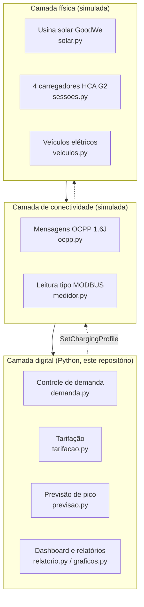
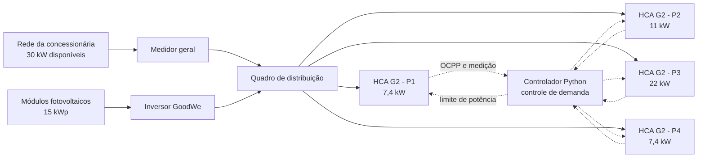
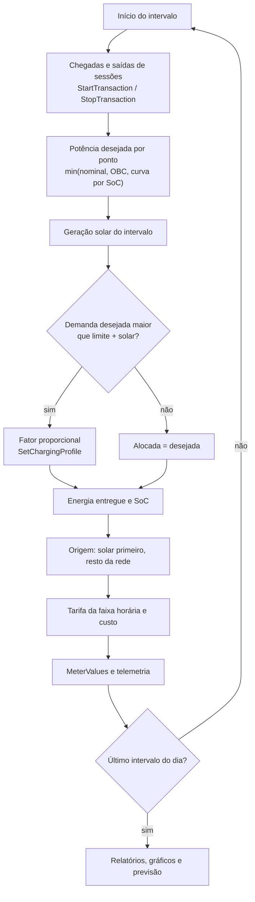
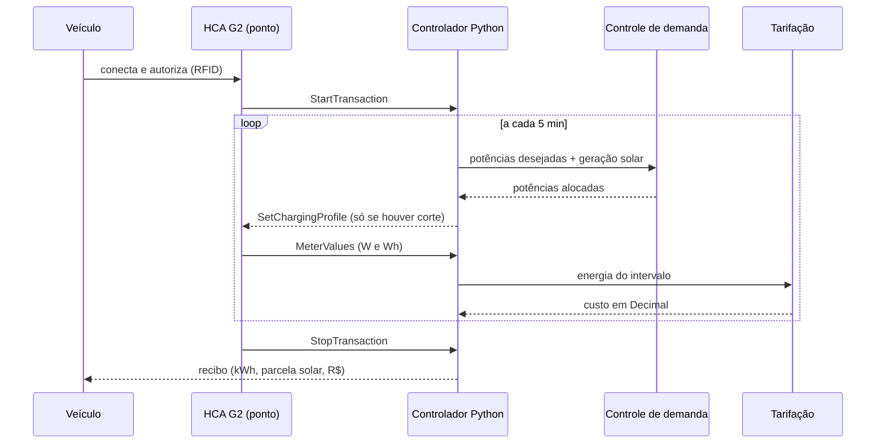

# Diagramas de arquitetura e integração

Diagramas em [Mermaid](https://mermaid.js.org/), renderizados automaticamente pelo GitHub.

## 1. Blocos: as três camadas da Sprint 1 no protótipo

## 2. Esquema elétrico unifilar simplificado

## 3. Fluxograma do laço de simulação (um intervalo de 5 min)

## 4. Sequência de uma sessão de recarga

